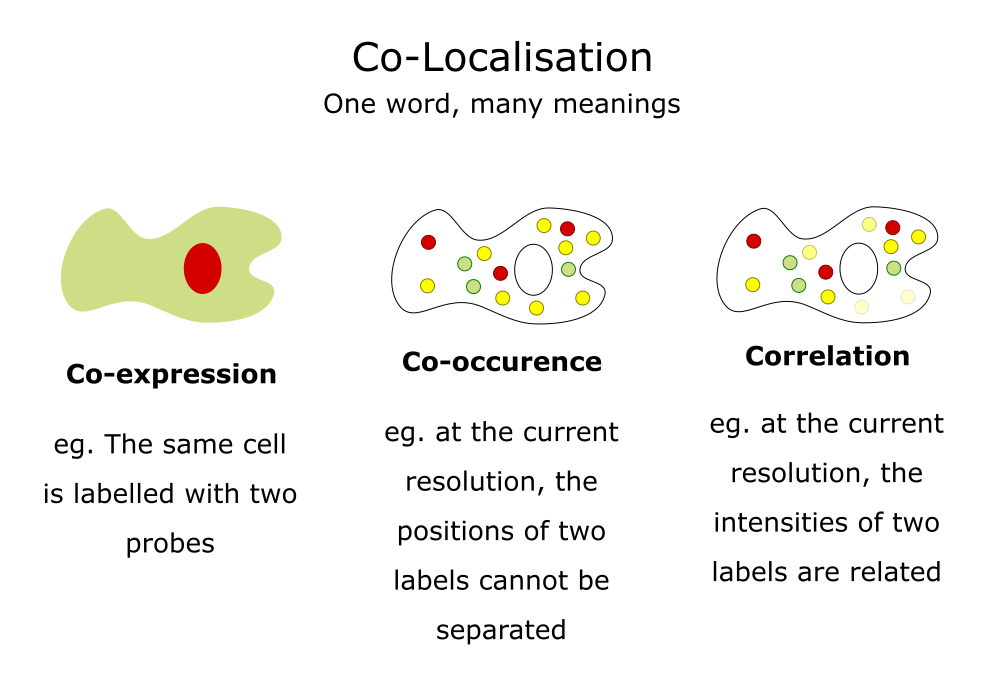
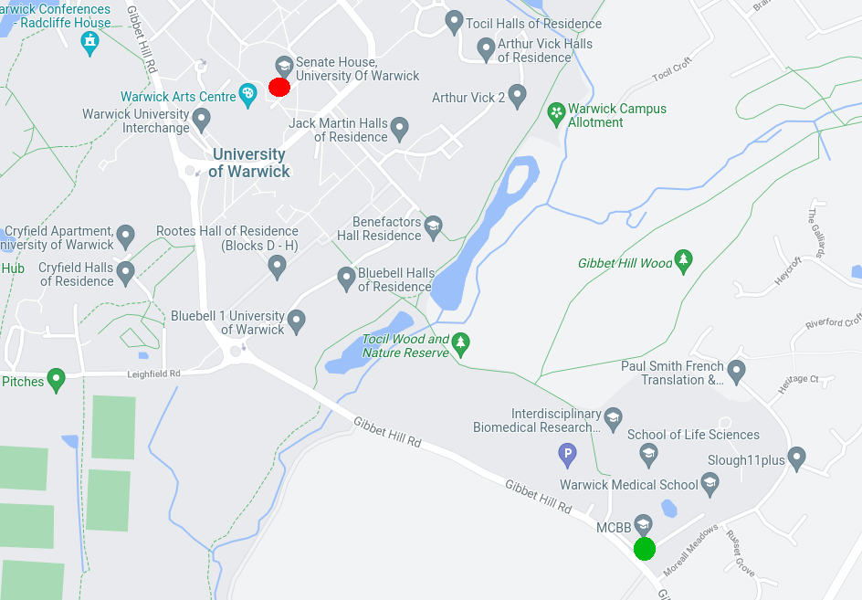
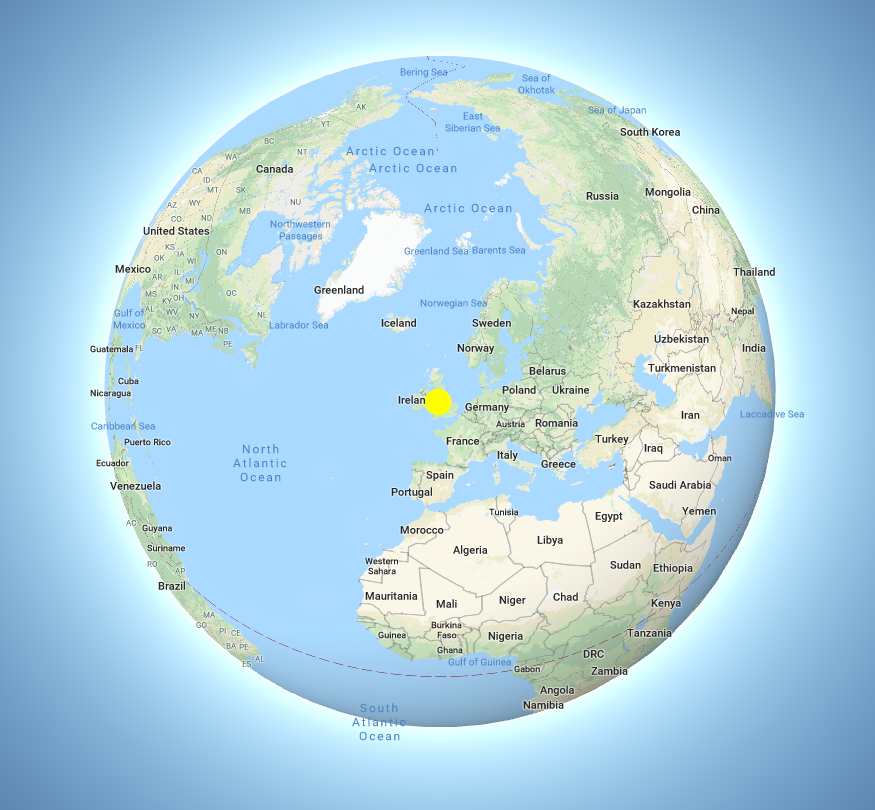
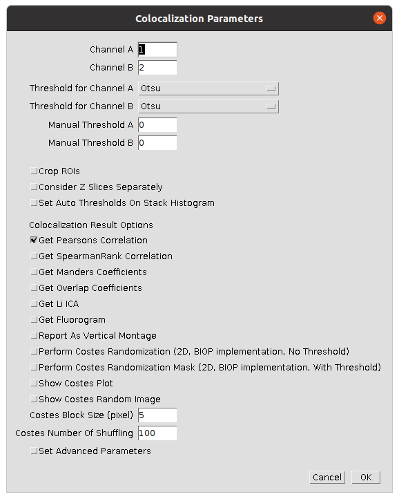
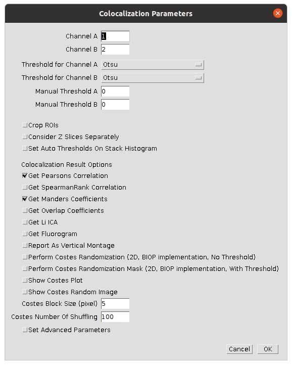

# Preparation

This worksheet is not assessed. Please work through it at your own pace. You may work on your own, with a partner or in a small group.

There are different sections in the worksheet:
- Sections of text to provide context
- **📋 Step-by-Step Instructions**: follow the steps, please ask if the steps are unclear or if you get stuck
- **🤔 Investigate**: suggested things to think about to improve your understanding of image analysis techniques and Fiji tools. These ideas should help you get started, but don't be limited to only these suggestions. Be curious, ask your own questions and experiment with the tools.
- **🔧 Apply Your skills**: A task is given without specific instructions. You should be able to attempt these tasks based on skills you have learnt on this or previous worksheets. Please ask if the task is unclear, something isn't working as you expect or you are unsure how to proceed. Also, you are welcome to design and solve your own task, we're happy to help even if it doesn't relate directly to the worksheets.

Please don't skip the Investigate sections and just rush through the Step-by-Step Instructions! The Investigate sections will help you to develop your own image analysis skills. Please ask if anything is unclear, you are unsure about the purpose of anything you are doing or you can't work out how to do something.

Before starting the worksheet, download the associated [Data folder](https://github.com/Laura190/ImageAnalysisWorksheets/raw/refs/heads/main/ColocalisationAndRegistration/Data.zip?download=) and follow the instructions below.


# Colocalisation

Uncredited image in this section are from [Dave Mason's image analysis course](https://bitbucket.org/davemason/imageanalysiswithfiji/src/master/).

Colocalisation analysis is used to understanding the spatial relationship between different fluorescent markers in microscopy images. However, it can mean different things:

<br>
Adapted from a slide by Fabrice Cordelieres

Colocalisation is **highly** dependent on resolution. For example, the [CAMDU](https://warwick.ac.uk/fac/sci/med/research/biomedical/facilities/camdu/) (green circle on right side of map) is not located in the same place as in Senate House (red circle on left side of map).

<br>

However, if we consider the whole world, both the CAMDU office and Senate House are located in the UK.

<br>

If you plan to use colocalisation analysis for your research, it is important to learn more about colocalisation than what is covered in this worksheet as there are many pitfalls. The ImageJ documentation has a [page on colocalisation](https://imagej.net/imaging/colocalization-analysis) and a useful paper is by [Bolte and Cordelieres](https://onlinelibrary.wiley.com/doi/10.1111/j.1365-2818.2006.01706.x).

### 📋 Step-by-Step Instructions

| Step | Action | Details |
|--------|-----------|------------|
| 1      | Open coloc.tif in Fiji  | Click and drag the coloc.tif file in to the main window of Fiji or open it using `File > Open...` |
| 2      | Compare the channels to see which have areas that overlap | Open the channels tool ```Image > Color > Channels Tool...```. Uncheck the boxes to hide the respective channel. Check two boxes at a time to see how each pair overlap. |

### 🤔 Investigate
- Can you view the channels in greyscale?
- Which channels do you think will colocalise?
- How can you change the colour of a channel?

To quantify the colocalisation in an image different coefficients can be used. Colocalisation plugins for Fiji will often offer a choice of coefficients. For this worksheet, we will use the [BIOP JACoP plugin](https://github.com/BIOP/ijp-jacop-b). This plugin is based on [JACoP](https://imagej.net/plugins/jacop) and [Coloc2](https://imagej.net/plugins/coloc-2) plugins and has been developed by the BioImaging and Optics Platform (BIOP) at EPFL (École polytechnique fédérale de Lausanne, Switzerland)). The BIOP JACoP plugin is not included with Fiji so we need to install it.

### 📋 Step-by-Step Instructions

| Step | Action | Details |
|--------|-----------|------------|
| 1      | Open Fiji's Updater  | Navigate to ```Help > Update...``` |
| 2      | Open the list of update sites | Click ```Manage Update Sites``` |
| 3      | Add the PTBIOP update site | In the search bar at the top enter ```biop```. Click the check box next to PTBIOP that will appear in the list below. Click ```Apply and Close``` |
| 4      | Apply the changes | Click ```Apply Changes``` and wait for the download to complete. Click ```OK``` when the "Updates successfully" message appears  |
| 5      | Restart Fiji | Close Fiji and open it again |
| 6      | Check the plugin has been installed | Open the Plugins menu and check that ```BIOP``` is listed. |

The BIOP update site contains more than just the JACoP plugin, however this is the only one we will use for this course.

## Pearson's correlation coefficient

Pearson's correlation coefficient compares how two variable change together compared to how they change on their own. In the context of colocalisation it is used to compare if the intensity value of channels change together or not. The formula for Pearson's correlation coefficient is
<br>
where n is the number of data points; x and y are the intensity values for two channels and ∑ denotes the summation. The numerator is the covariance between the intensity values in the two channels. This indicates how much the variables change together verses on their mean values. The denominator is the product of the variability in the intensity values of the two individual channels.

If the Pearson's correlation coefficient is close to:
- +1: Positive correlation. As the intensity in one channel increases so does the intensity in the second channel.
- 0: No significant correlation, the signals are spatially independent.
- -1: Negative correlation. As the intensity in one channel increases, it decreases in the second channel.

The Pearson's correlation coefficient works well for complete colocalisation or exclusion. Reliable conclusions cannot be drawn from midrange values (-0.5 to 0.5). This makes it unsuitable for cases where there is a lot of noise or only partial colocalisation. Bleedthrough can be particularly problematic as it will bias the results towards a correlated value. 

### 📋 Step-by-Step Instructions

| Step | Action | Details |
|--------|-----------|------------|
| 1      | Start the BIOP JACoP plugin  | Navigate to ```Plugins > BIOP > Image Analysis > BIOP JACoP``` |
| 2      | Set suitable parameters to compare the first two channels | Select the settings shown in the image <br>  |

### 🤔 Investigate
- What output's do you get from running the plugin? There should be three output windows: Results, Log and an image. What information do you get from each?
- What is Pearson's correlation coefficient for different pairs of images?
- Do the values returned by the plugin meet your expectations for which channels you thought would colocalise?

## Manders' Overlap Coefficient

Manders' Overlap Coefficient is the ratio of the summed intensities of pixels from one channel for which the intensity in the second channel is above zero to the total intensity in the first channel. It removes some of the intensity dependence of Pearson's and provides channel-specific overlap coefficients (M1 and M2). The values of Manders' Overlap Coefficient range from from 0, no overlap, to 1, complete overlap.

### 📋 Step-by-Step Instructions

| Step | Action | Details |
|--------|-----------|------------|
| 1      | Start the BIOP JACoP plugin  | Navigate to ```Plugins > BIOP > Image Analysis > BIOP JACoP``` |
| 2      | Set suitable parameters to compare the first two channels | Select the settings shown in the image <br>  |

### 🤔 Investigate
- What output's do you get from running the plugin? There should be three output windows: Results, Log and an image. What information do you get from each?
- What are the M1 and M2 coefficient for different pairs of images?
- Do the values returned by the plugin meet your expectations for which channels you thought would colocalise?
- BIOP JACoP lists a number of other coefficients and options, what are they and what do they do?

## 🔧 Apply your skills

Use BIOP JACoP to investigate the colocalisation of the three channels in ```File > Open Samples > Fluorescent Cells```.

# Registration

Image registration is the process of aligning two or more images of the same scene taken at different times or by different microscopes. In some cases, even when imaging a fixed sample of the same microscope there can be misalignment between the different fluorescence channels. Fixing this issue is crucial for subsequent analysis such as colocalisation. Image registration can be used to align images from different imaging modalities, correct for sample drift during imaging or to remove sample movement so that internal dynamic processes can be studied.

For this worksheet we will use [StackReg](https://bigwww.epfl.ch/thevenaz/stackreg/) from  [EPFL’s Biomedical Imaging Group (BIG)](https://bigwww.epfl.ch/).

### 📋 Step-by-Step Instructions

| Step | Action | Details |
|--------|-----------|------------|
| 1      | Open Fiji's Updater  | Navigate to ```Help > Update...``` |
| 2      | Open the list of update sites | Click ```Manage Update Sites``` |
| 3      | Add the BIG-EPFL update site | In the search bar at the top enter ```BIG```. Click the check box next to BIG-EPFL that will appear in the list below. Click ```Apply and Close``` |
| 4      | Apply the changes | Click ```Apply Changes``` and wait for the download to complete. Click ```OK``` when the "Updates successfully" message appears  |
| 5      | Restart Fiji | Close Fiji and open it again |
| 6      | Check the plugin has been installed | Open the Plugins menu and check that ```StackReg``` is listed. |

The BIG-EPFL update site contains more than just the StackReg plugin, however this is the only one we will use for this course.

### 📋 Step-by-Step Instructions

| Step | Action | Details |
|--------|-----------|------------|
| 1      | Open ```Katies-chicken-cell-infected-with-virus-t50.tif``` in Fiji  | Click and drag the ```Katies-chicken-cell-infected-with-virus-t50.tif``` file in to the main window of Fiji or open it using `File > Open...` |
| 2      | Play the movie to see how the position of the nucleus changes | Click the ▶️ arrow in the lower left hand corner of the image window. |
| 3      | Look at the maximum projection over time to see how the position of the nucleus changed | Navigate to ```Image > Stacks > Z Project...``` and select ```Max Intensity``` for the ```Projection type``` |
| 4      | Duplicate the time series | Select the ```Katies-chicken-cell-infected-with-virus-t50.tif``` image window. Use  ```Image > Duplicate...``` or ```ctrl+shift+d```. Ensure the ```Duplicate stack``` option is selected. |
| 5      | Use ```StackReg``` to register the image | Navigate to ```Plugins > StackReg```. Select ```Rigid Body``` from the ```Transformation``` drop down. Click ```OK```. Wait for Fiji to finish processing the stack |
| 6      | Maximum project the registered stack to compare the results | Navigate to ```Image > Stacks > Z Project...``` and select ```Max Intensity``` for the ```Projection type``` |

### 🤔 Investigate
- StackReg has 4 different transforms: Translation, Rigid Body, Scaled Rotation and Affine. Read the [StackReg](https://bigwww.epfl.ch/thevenaz/stackreg/) or ask for favourite chat bot ([Bioimage.io Chat](https://bioimage.io/chat/)) to understand what each of them do. Try out the different transforms. Which do you think is most appropriate for registering ```Katies-chicken-cell-infected-with-virus-t50.tif```? 
- In the ```Plugins > Registration``` menu in Fiji there are more plugins designed for registering images. Experiment with a couple of them to see how they compare to StackReg. Look online for relevant documentation to understand what they can do.

# References

Bolte, S., & Cordelieres, F. P. (2006). A guided tour into subcellular colocalization analysis in light microscopy. Journal of Microscopy, 224(3), 213–232. [doi:10.1111/j.1365-2818.2006.01706.x](https://doi.org/10.1111/j.1365-2818.2006.01706.x)

P. Thévenaz, U.E. Ruttimann, M. Unser, "A Pyramid Approach to Subpixel Registration Based on Intensity," IEEE Transactions on Image Processing, vol. 7, no. 1, pp. 27-41, January 1998. [doi:10.1109/83.650848](https://doi.org/10.1109/83.650848) 
