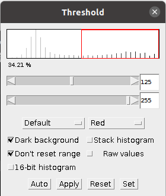

# Preparation

This worksheet is not assessed. Please work through it at your own pace. You may work on your own, with a partner or in a small group.

There are different sections in the worksheet:
- Sections of text to provide context
- **📋 Step-by-Step Instructions**: follow the steps, please ask if the steps are unclear or if you get stuck
- **🤔 Investigate**: suggested things to think about to improve your understanding of image analysis techniques and Fiji tools. These ideas should help you get started, but don't be limited to only these suggestions. Be curious, ask your own questions and experiment with the tools.
- **🔧 Apply Your skills**: A task is given without specific instructions. You should be able to attempt these tasks based on skills you have learnt on this or previous worksheets. Please ask if the task is unclear, something isn't working as you expect or you are unsure how to proceed. Also, you are welcome to design and solve your own task, we're happy to help even if it doesn't relate directly to the worksheets.

Please don't skip the Investigate sections and just rush through the Step-by-Step Instructions! The Investigate sections will help you to develop your own image analysis skills. Please ask if anything is unclear, you are unsure about the purpose of anything you are doing or you can't work out how to do something.

Before starting the worksheet, download the associated [Data folder](https://github.com/Laura190/ImageAnalysisWorksheets/raw/refs/heads/main/CountingAndMeasuringObjects/Data.zip?download=) and follow the instructions below.

### 📋 Step-by-Step Instructions

| Step | Action | Details |
|--------|-----------|------------|
| 1      | Open Fiji | Find the executable in the downloaded Fiji folder and double-click to launch it. |
| 2      | Open the Macro Recorder | Navigate to `Plugins > Macro > Record`. |

# Learning Objectives

By following this worksheet, you will learn about the following concepts:
- Local maxima
- Filters
- Thresholds
- Binary operations

You will also learn how to use tools in Fiji to:
- Count objects
- Segment an image
- Measure objects
- Save a record what you have done interactively
- Create a macro to run a sequence of steps automatically

# Counting Objects

A common task in image analysis is counting how many objects are in an image. In fluorescence microscopy images objects are identified as having a different intensity from the background. We can use a tool called `Find Maxima` to identify location of objects and count how many there are. The `Find Maxima` tool identifies local maxima based on a user defined **prominence** value. The prominence value is a measure of how distinct a peak is from it's surroundings. The higher the prominence value, the more distinct a peak is from it's surroundings. The `Find Maxima` tool can also identify local minima by selecting the **Light background** option.

### 📋 Step-by-Step Instructions

| Step   | Action    | Details |
|--------|-----------|------------|
| 1      | Open an Image | Go to `File > Open Samples > Dot Blot`. |
| 2      | Count how many dots are in the image | Manually count the number of dots and make a note of this value |
| 3      | Run the `Find Maxima` tool | Navigate to `Process > Find Maxima...` |
| 4      | Set the prominence value to 10 | Enter 10 in the Prominence box |
| 5      | Select the Light background option | Check the Light background box |
| 6      | Set output type to Count | Click the drop down box next to Output type |
| 7      | Select the Preview point selection option | Check the Preview point selection box |
| 8      | Note the number of dots identified | The number of maxima will be show in the lower left of the `Find Maxima` dialog box |

### 🤔 Investigate
- Does the number of dots identified by `Find Maxima` match your manual count? Why not?
- Can you alter the prominence value to get a more accurate count? Why not?
- What else could you try to get a more accurate count? What preprocessing steps could you take?

## 🧂 Applying a Filter

There are some small areas of noise in the image, which causes the `Find Maxima` count to be incorrect. Changing the prominence value doesn't help because those small areas of noise are more distinct from the background than some of the dots. To get a more accurate count, a filter can be used before running the `Find Maxima` tool. 

### 📋 Step-by-Step Instructions

| Step   | Action    | Details |
|--------|-----------|------------|
| 1      | Close the `Find Maxima` window | Click Cancel in the `Find Maxima` window |
| 2      | Apply a Median filter with radius 4 | Navigate to `Process > Filters > Median` and enter 4 in the Radius box. Click OK. |
| 3      | Run the `Find Maxima` tool with prominence value 5 | Navigate to `Process > Find Maxima...` and enter 5 in the Prominence box |
| 4      | Check the other settings are the same a before | Look at the previous instructions and check that the options in steps 5-7 are selected. |
| 5      | Note the number of dots identified | The number of maxima will be show in the lower left of the `Find Maxima` dialog box |

### 🤔 Investigate
- Does the number of dots identified by `Find Maxima` match your manual count?
- Why was the value of 4 used for the radius of the median filter?
- What value should you enter for the prominence value to count only the 3 darkest dots?
- What happens if you click OK on the `Find Maxima` tool?
- What changes is you select a different output type from the `Find Maxima` tool?
If `Find Maxima` does not give you an accurate count, please ask for help.

# Segmentation

Sometimes we want to know more about our objects than just how many there are, such as measuring their size. Segmentation is the first step. Segmentation is the separation of an image into areas of interest and areas that are not of interest. The end point for most segmentation is a binary mask. This can be represented as a logical array with true and false values; or a binary array with 0 and 1 values; or an array with only minimum and maximum values e.g. 0 and 255 for an 8-bit image.

| Original Image | Segmentation |
|----------------|--------------|
|  |  |
|  |  |

A binary mask can be used to count, measure or visualise objects.

## 🎭 Thresholding

Thresholding separates the pixels in an image into two (or more) classes based on intensity. Usually the classes are **foreground** (the objects we care about) and the **background** (the area we don't). This creates a binary mask which can be used for counting, measuring, or visualizing the objects of interest.

### 📋 Step-by-Step Instructions

| Step | Action | Details |
|--------|-----------|------------|
| 1      | Open an Image | Go to `File > Open Samples > Blobs`. |
| 2      | Invert the LUT | Click the LUT button in the Fiji toolbar and click **Invert LUT**.    |
| 3      | Experiment with Manual Thresholds | Go to `Image > Adjust > Threshold` and move the sliders. Watch how the red area on the image changes as you move the slider.    |
| 4      | Create a Mask | Click "Apply" |

### 🤔 Investigate
- Why did you need to invert the LUT? If you are not sure, please ask.
- What do the two sliders do?
- What difference does checking the Dark background box make to the mask?​
- Look in the macro recorder output, which lines set the threshold value and apply the mask?​

## 💻 Automatic Thresholding

A manual threshold can be inconsistent and subjective. To overcome these issues, automatic thresholding methods can be used.

### 📋 Step-by-Step Instructions

| Step | Action | Details |
|--------|-----------|------------|
| 1      | Open an Image | Go to `File > Open Samples > Blobs`. |
| 2      | Open the Auto Threshold Tool | Navigate to `Image > Adjust > Auto Threshold`.    |
| 3      | Use the Default Settings | Click "OK" |

A montage showing the results from the different automatic thresholding methods should appear. The name of the method is written under each binary copy of blobs, you may need to zoom in using the magnifying tool to read them. Ask for help if you don't get an image montage or you can't see the method names.

### 🤔 Investigate
- Which automatic thresholding method gives the best results for thresholding the blobs image?
- Look up the description of that method on the [Auto Threshold page on the ImageJ website](https://imagej.net/plugins/auto-threshold). Decide if the method you chose is suitable for thresholding the blobs image, e.g. does the method make any assumptions about the histogram?
- Why are the results for the Default and IsoData algorithms similar?

### 📋 Step-by-Step Instructions

| Step  | Action | Details |
|-------|-----------|------------|
| 1     | Open an Image | Go to `File > Open Samples > Blobs`. |
| 2     | Open the Auto Threshold Tool | Navigate to `Image > Adjust > Auto Threshold`. |
| 3     | Select a method based on the previous exercise | Click on the Method drop down box and choose a method, then click "OK" |

You should now have a binary mask of the blobs image. If not, please ask for help.

# Connected Component Analysis

Connected component analysis (CCA) is used to identify contiguous (joined up) objects in a mask. In Fiji for 2D images this can be done using the [Analyze Particles](https://imagej.net/ij/docs/menus/analyze.html#ap) tool.

### 📋 Step-by-Step Instructions

| Step  | Action | Details |
|-------|-----------|------------|
| 1     | Make your binary mask the active image | Click on the window containing the binary mask |
| 2     | Start the Analyze Particles tool | Navigate to `Analyze > Analyze Particles`. |
| 3     | Select the required settings and run the tool | Match the settings shown in the image      then click "OK" |

You should get Results window with some measurements as well as an image where each blob is a different shade of grey. If you want to display the results with each blob a different colour, change the Look Up Table (LUT). Click the LUT button in the Fiji Toolbar and select one of the **glasbey** options.

## 📐 Measurements

The measurements you see in the Results window will depend on the settings in Fiji. Some useful measurements to make when working with `Analyse Particles` are Area, which relates to the Size parameter and Circularity, which relates to the shape of the objects. The `Set Measurements` tool is used to choose what measurements are made. Read the [Set Measurements...](https://imagej.net/ij/docs/menus/analyze.html#set) documentation for information about the different measurements.

### 📋 Step-by-Step Instructions

| Step  | Action | Details |
|-------|-----------|------------|
| 1     | Open `Set Measurements` | Navigate to `Analyze > Set Measurements...` |
| 2     | Select the required settings and run the tool | Check the boxes new to Area and Shape descriptors and uncheck all the other boxes, click OK |
| 3     | Run `Analyze Particles` | Match the settings shown in the image      then click "OK"

Particles of any size and shape are measured, which can introduce errors when measuring object properties such as size. Objects that should be excluded include:
- Small objects containing only a few pixels, as they are likely noise.
- Objects on the image borders, as they are partial objects and incomplete.

### 🤔 Investigate
- Using the measurements in the results table, can you change the settings in `Analyze Particles` to exclude small objects?
- Can you change the settings in `Analyze Particles` to exclude objects on the image borders?
- Try out some of the different options in the `Show` drop down box to view the different outputs available.
- Try out some of the different checkbox settings, do they change the results? Or produce different outputs?
- Try using `Find Maxima` on the same image, do both methods count the same number of objects? Why or why not?
  
Please ask for help if you are unsure how to exclude objects from the `Analyze Particles` results or if you aren't sure how to use `Find Maxima`.

## 🏁 Binary operations

Sometimes just thresholding an image does not create a binary mask suitable for connected component analysis. If this is the case, binary operations can be used to improve the suitability of the mask. The binary operations available in Fiji are described in the ImageJ documentation in the [binary section of the process menu](https://imagej.net/ij/docs/menus/process.html#binary).

One tool that is helpful when segmenting round objects like nuclei or nanoparticles is the watershed tool. Watershed segmentation automatically separates round objects that touch. Assuming that blobs is an image of some round objects, try separating them using the watershed tool.

| Step  | Action | Details |
|-------|-----------|------------|
| 1     | Make your binary mask the active image | Click on the window containing the binary mask |
| 2     | Apply watershed segmentation | Navigate to `Process > Binary > Watershed`. |
| 3     | Run connected component analysis | Navigate to `Analyze > Analyze Particles` and run the tool with suitable settings (the previous settings should work) |

### 🤔 Investigate
- How did the watershed segmentation change the mask?
- What is the difference between the binary operations erode and dilate? How do they affect the measurements?
- What is the difference between the binary operations opening and closing? How do they affect the measurements?
- What does `skeletonize` do? Can you think of a situation when you might use it?
  
Please ask for help if you are uncertain how to apply the watershed segmentation or are unclear what the binary operations do.

## 💾 Save your current progress

While you have been working the Macro Recorder has been keeping a list of all the commands you have run by clicking in the graphical interface. Some of these will be things you meant to do, some will be things you clicked accidentally and some will be things you tried and rejected. It can be useful to save the Recorder output in case you want to revisit what you have done or remind yourself how you did something .

### 📋 Step-by-Step Instructions

| Step  | Action | Details |
|-------|-----------|------------|
| 1     | Make the Macro Recorder the active window | Click on the window containing the Macro Recorder |
| 2     | Create an ImageJ Macro file from the recorded contents | Click `Create`. The Script Editor will open. |
| 3     | Save the macro file | In the Script Editor go to `File > Save As...` and select the location to save and enter a name for the macro. Click `Save`|

This Macro file may not actually run or do anything useful, it is simply to keep a record of what you have tried. For saving the Macro Recorder output, you may find it useful to include the date and a short description of what you were attempting to do or include record in the title, e.g. 20241010_segment_blobs.ijm. This will make the recordings easily identifiable from the macros you write yourself that do run.

## 🔧 Apply Your skills

Try applying the skills you have learnt above to segment, count and measure the nuclei in `nuclei.tif` Once the file has downloaded you can open it in Fiji either by clicking and dragging the file to the main Fiji window or using `File > Open...`. Make sure you have the Macro Recorder open to keep track of what you are doing. If you want to clear the Recorder before you start, close the window and open it again. The steps you should take are:
- Threshold the nuclei to create a binary mask.
- If necessary, apply functions to the binary mask to prepare it for connected component analysis.
- Use connected component analysis to count and measure the individual nuclei.
  
You will need to test different methods and settings to find a workflow that counts the nuclei accurately.

## ✍️ Creating a Macro

If you are happy with the workflow you have created in the previous section, save the output of the Recorder and clear it. Redo the steps of your workflow so that the Recorder contains only the necessary commands. You can delete individual lines from the Recorder by clicking on the line and using backspace or delete. Use the recording to create a Macro.

### 📋 Step-by-Step Instructions

| Step  | Action | Details |
|-------|-----------|------------|
| 1     | Open the nuclei image | Click and drag the nuclei.tif file in to the main window of Fiji or open it using `File > Open...` |
| 2     | Run the macro on the nuclei image | Click `Run` in the Script Editor Window. |

### 🤔 Investigate
- Did the macro stop unexpectedly? Did an error message appear after clicking `Run`? If so, ask for help to fix the errors.
- Is the result from running the macro the same as when you did it manually? If not, why not?
- Think about what each line of code does. Try explaining it to someone or describe it using an annotation. If you are not unsure what each line does, please ask.

## ♻️ Apply the Macro to Another Image

Open `live_nuclei.tif`. This is a 2D widefield fluorescence image of live nuclei. Try running your macro on this image.

### 🤔 Investigate
- Did the macro stop unexpectedly? Did an error message appear after clicking `Run`? If so, ask for help to fix the errors.
- Do you think the macro produced an accurate results on this new image? Why or why not?
- Is there anything you could change in the macro to improve the results?
- Try using `Find Maxima` on the same image. Do both methods count the same number of cells? Why or why not?

## 🔧 Apply Your skills

Using the skills you've learnt during this worksheet, can you count the rings in the `Tree Rings` sample image?

# Please complete the learning objective survey

  [Vevox.app Session ID: 195-061-937](https://vevox.app/#/m/195061937)
