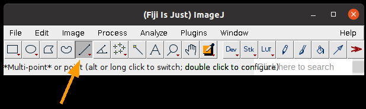
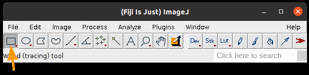

# Preparation

This worksheet is not assessed. Please work through it at your own pace. You may work on your own, with a partner or in a small group.

There are different sections in the worksheet:
- Sections of text to provide context
- **:clipboard: Step-by-Step Instructions**: follow the steps, please ask if the steps are unclear or if you get stuck
- **:thinking: Investigate**: suggested things to think about to improve your understanding of image analysis techniques and Fiji tools. These ideas should help you get started, but don't be limited to only these suggestions. Be curious, ask your own questions and experiment with the tools.

Please don't skip the thinking sections and just rush through the step-by-step instructions! The thinking sections will help you to develop your own image analysis skills. Please ask if anything is unclear, you are unsure about the purpose of anything you are doing or you can't work out how to do something.

Before starting the worksheet, download the associated Data folder from Moodle and follow the instructions below.

### :clipboard: Step-by-Step Instructions

| Step | Action | Details |
|--------|-----------|------------|
| 1      | Open Fiji | Find the executable in the downloaded Fiji folder and double-click to launch it. |
| 2      | Open the Macro Recorder | Navigate to `Plugins > Macro > Record`. |

# Learning Objectives
...

# :triangular_ruler: Making Selections

In the previous worksheet, we used `Analyze Particles` to identify and measure objects. There are more ways to make measurements in Fiji.

### :clipboard: Step-by-Step Instructions

| Step | Action | Details |
|--------|-----------|------------|
| 1      | Open any image in Fiji | Navigate to `File > Open` and select a file or click and drag an image file into the Fiji toolbar or select an image from `File > Open Samples...`  |
| 2      | Select the Line Selection tool | Click the Line Selection tool on the Fiji toolbar   |
| 3      | Draw a line anywhere on the image | Click anywhere on the image, then move the mouse and click somewhere else on the image. You should see a yellow line stretch between the two points.
| 4      | Plot the intensity profile along the line | Go to `Analyze > Plot Profile` |

A plot will appear with **Grey Value** on the y-axis and **Distance** on the x-axis. The Distance is the distance along the drawn line. The Grey Value is the intensity of the pixels along the line.

### :thinking: Investigate
- If you used an RGB image, what value is plotted by Plot Profile?
- Double clicking the Line selection tool lets to change the width of the line, how does this change the intensity profile?
- What happens if you hold shift while drawing the line?

 ### :clipboard: Step-by-Step Instructions

| Step | Action | Details |
|--------|-----------|------------|
| 1      | Select the Rectangle Selection tool | Click the Rectangle Selection tool on the Fiji toolbar   |
| 2      | Draw a rectangle anywhere on the image | Click anywhere on the image, then move the mouse and click somewhere else on the image. You should see a yellow rectangle stretch between the two points. |
| 3      | Measure the properties of the rectangle | Go to `Analyze > Measure` or press the `m` key |

A Results window will appear with measurements made based on the rectangular selection. The measurements can be selected by changing the settings in `Analyze > Set Measurements` (see the [CountingAndMeasuringObjects](CountingAndMeasuringObjects/CountingAndMeasuringObjects.md) worksheet for more details).

### :thinking: Investigate
- If you used an RGB image, what values are used for the intensity measurements?
- What does double clicking the Rectangle selection tool do?
- What happens if you hold shift while drawing the rectangle?
- Can you move the same sized rectangle to another part of the image?

## :card_file_box: ROI Manager

The **ROI (region of interest) manager** is used to store and measure selections.

### :clipboard: Step-by-Step Instructions

| Step | Action | Details |
|--------|-----------|------------|
| 1      | Make a selection | Select any of the selection tools from the Fiji toolbar and click on the image to create a selection |
| 2      | Add the selection to the ROI manager | Press 't' or go to `Edit > Selection > Add to Manager |
| 3      | Add some more selections | Repeat steps 1 and 2 |
| 4      | Measure all the selections | In the ROI manager window, click `More > Multi-measure`. Leave the default settings and click OK for the dialog box that appears. A results window will appear with measurements for each selection |
| 5      | Save the selections | In the ROI manager window, click `More > Save...`. Select the save location and name the file. Click Save. |

### :thinking: Investigate
- What happens if you select/don't select the **One row per slice** option in the multi-measure dialog box?
- Why is it a good idea to save the selections you have made with the measurements? Please ask if you are unsure.
- What happens if you click `Measure` in the ROI manager rather than using multi-measure?
- What happens if you select one of the ROIs in the ROI manager (by clicking on the name of the ROI) and then click measure?
- What option from `Analyze Particles` can you use to add the regions detected using connected component analysis to the ROI manager?