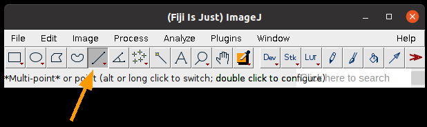
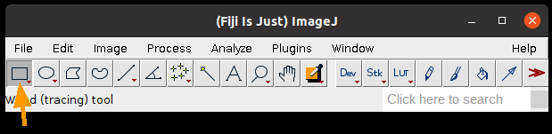
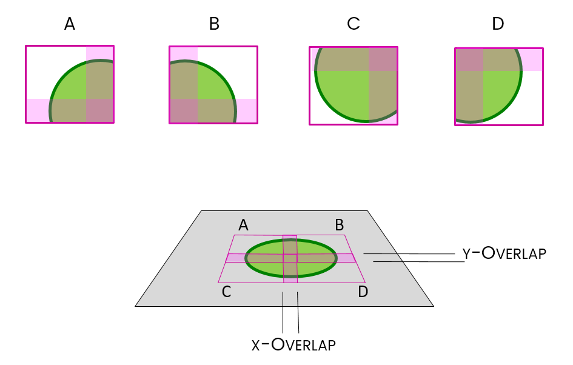
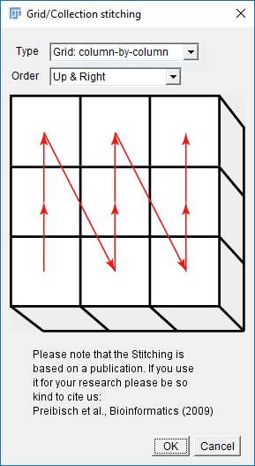
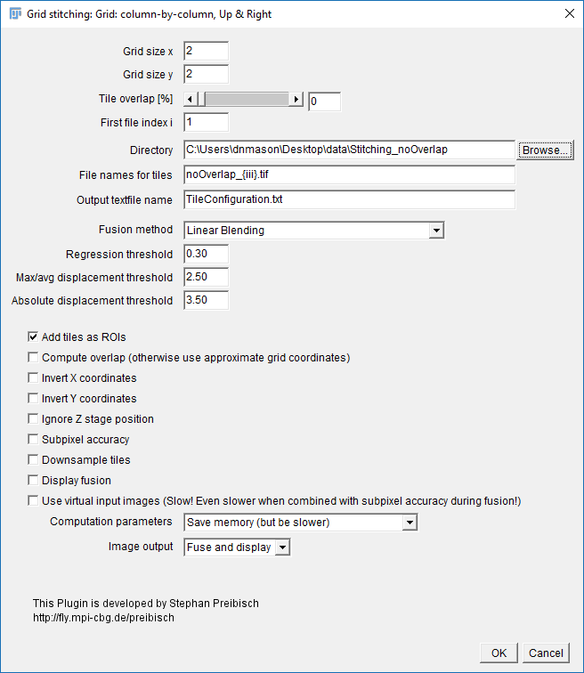
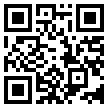

# Preparation

This worksheet is not assessed. Please work through it at your own pace. You may work on your own, with a partner or in a small group.

There are different sections in the worksheet:
- Sections of text to provide context
- **:clipboard: Step-by-Step Instructions**: follow the steps, please ask if the steps are unclear or if you get stuck
- **:thinking: Investigate**: suggested things to think about to improve your understanding of image analysis techniques and Fiji tools. These ideas should help you get started, but don't be limited to only these suggestions. Be curious, ask your own questions and experiment with the tools.
- **:wrench: Apply Your skills**: A task is given without specific instructions. You should be able to attempt these tasks based on skills you have learnt on this or previous worksheets. Please ask if the task is unclear, something isn't working as you expect or you are unsure how to proceed. Also, you are welcome to design and solve your own task, we're happy to help even if it doesn't relate directly to the worksheets.

Please don't skip the Investigate sections and just rush through the Step-by-Step Instructions! The Investigate sections will help you to develop your own image analysis skills. Please ask if anything is unclear, you are unsure about the purpose of anything you are doing or you can't work out how to do something.

Before starting the worksheet, download the associated [Data folder]() from Moodle and follow the instructions below.

### :clipboard: Step-by-Step Instructions

| Step | Action | Details |
|--------|-----------|------------|
| 1      | Open Fiji | Find the executable in the downloaded Fiji folder and double-click to launch it. |
| 2      | Open the Macro Recorder | Navigate to `Plugins > Macro > Record`. |

You may want to save the output of the Recorder are restart it at the end of each section.

# Learning Objectives

- How to make measurements using selection tools
- How to use the ROI manager to manage and save selections
- How to stitch images together
- How to use the Batch Processing window to process multiple images

# :triangular_ruler: Making Measurements

In the previous worksheet, we used `Analyze Particles` to identify and measure objects. There are more ways to make measurements in Fiji.

### :clipboard: Step-by-Step Instructions

| Step | Action | Details |
|--------|-----------|------------|
| 1      | Open any image in Fiji | Navigate to `File > Open` and select a file or click and drag an image file into the Fiji toolbar or select an image from `File > Open Samples...`  |
| 2      | Select the Line Selection tool | Click the Line Selection tool on the Fiji toolbar   |
| 3      | Draw a line anywhere on the image | Click anywhere on the image, then move the mouse and click somewhere else on the image. You should see a yellow line stretch between the two points.
| 4      | Plot the intensity profile along the line | Go to `Analyze > Plot Profile` |

A plot will appear with **Grey Value** on the y-axis and **Distance** on the x-axis. The Distance is the distance along the drawn line. The Grey Value is the intensity of the pixels along the line.

### :thinking: Investigate
- If you used an RGB image, what value is plotted by Plot Profile?
- Double clicking the Line selection tool lets to change the width of the line, how does this change the intensity profile?
- What happens if you hold shift while drawing the line?

 ### :clipboard: Step-by-Step Instructions

| Step | Action | Details |
|--------|-----------|------------|
| 1      | Select the Rectangle Selection tool | Click the Rectangle Selection tool on the Fiji toolbar   |
| 2      | Draw a rectangle anywhere on the image | Click anywhere on the image, then move the mouse and click somewhere else on the image. You should see a yellow rectangle stretch between the two points. |
| 3      | Measure the properties of the rectangle | Go to `Analyze > Measure` or press the `m` key |

A Results window will appear with measurements made based on the rectangular selection. The measurements can be selected by changing the settings in `Analyze > Set Measurements` (see the [CountingAndMeasuringObjects](CountingAndMeasuringObjects/CountingAndMeasuringObjects.md) worksheet for more details).

### :thinking: Investigate
- If you used an RGB image, what values are used for the intensity measurements?
- What does double clicking the Rectangle selection tool do?
- What happens if you hold shift while drawing the rectangle?
- Can you move the same sized rectangle to another part of the image?

## :card_file_box: ROI Manager

The **ROI (region of interest) manager** is used to store and measure selections.

### :clipboard: Step-by-Step Instructions

| Step | Action | Details |
|--------|-----------|------------|
| 1      | Make a selection | Select any of the selection tools from the Fiji toolbar and click on the image to create a selection |
| 2      | Add the selection to the ROI manager | Press 't' or go to `Edit > Selection > Add to Manager |
| 3      | Add some more selections | Repeat steps 1 and 2 |
| 4      | Measure all the selections | In the ROI manager window, click `More > Multi-measure`. Leave the default settings and click OK for the dialog box that appears. A results window will appear with measurements for each selection |
| 5      | Save the selections | In the ROI manager window, click `More > Save...`. Select the save location and name the file. Click Save. |

### :thinking: Investigate
- What happens if you select/don't select the **One row per slice** option in the multi-measure dialog box?
- Why is it a good idea to save the selections you have made with the measurements? Please ask if you are unsure.
- What happens if you click `Measure` in the ROI manager rather than using multi-measure?
- What happens if you select one of the ROIs in the ROI manager (by clicking on the name of the ROI) and then click measure?
- What option from `Analyze Particles` can you use to add the regions detected using connected component analysis to the ROI manager?

# Stitching

Uncredited image in this section are from [Dave Mason's image analysis course](https://bitbucket.org/davemason/imageanalysiswithfiji/src/master/).

Increasing the spatial resolution when imaging almost always leads to a reduced field of view. A common areas for this are histology and astronomy. The image below is made up of 690 individual frames taken with the CEERS Near Infrared Camera (NIRCam). There are more details and high resolution images in the [CEERS webpage](https://ceers.github.io/ceers-first-images-release.html).

From: [CEERS-iously wide imaging. Woods, P. Nat Astron (2022), 6, 1007; https://doi.org/10.1038/s41550-022-01790-0](https://doi.org/10.1038/s41550-022-01790-0)

On a microscope, this can be achieved with tile scanning (i.e. imaging multiple adjacent fields). 

Stitching is the method used to put them back together again. Adjacent tiles can contain some overlap, this can improve the stitching results. 

Things to remember when using Grid/Collection Stitching:
- All calibration information is stripped
- Stitching will have a harder time with sparse features or [uneven illumination](https://postacquisition.wordpress.com/2015/06/17/its-a-stitch-up/)

Most importantly, before you start you need to know your data:
- Grid layout (dimensions and order)
- Overlap
- Calibration

## :broken_heart: No Overlap

### :clipboard: Step-by-Step Instructions

| Step | Action | Details |
|--------|-----------|------------|
| 1      | Unzip `Stitching_noOverlap.zip` | In your file browser, navigate to the downloaded Data folder. Find `Stitching_noOverlap.zip` and unzip it to a known location |
| 2      | Run the Stitching plugin | Run `Plugins > Stitching > Grid/Collection Stitching` |
| 3      | Select the stitching order to Column by Column and Up and right  | Match the settings   |
| 4      | Select the appropriate settings:  Grid Size: 2x2  Tile Overlap: 0   Directory: {path to your folder}  File Names: replace the numbers with {i} zero pad with more i - noOverlap_{iii}.tif  Uncheck all the options except `Add tiles as ROIs` | Match the settings below except for the `Directory` path. Set that to where you unzipped `Stitching_noOverlap.zip`   |
| 5      | Run the stitching  | Click OK and accept fast fusion if asked. |

### :thinking: Investigate
- What does the resulting image show? Is it what you expect?
- What information do the messages in the Log window provide?
- Think about the settings you used. What do they tell the software?

### :clipboard: Step-by-Step Instructions

| Step | Action | Details |
|--------|-----------|------------|
| 1      | Close all the additional windows | Click the window close buttons on all Fiji windows except the main toolbar and the macro recorder |
| 2      | Run the Stitching plugin | Run `Plugins > Stitching > Grid/Collection Stitching` |
| 3      | Use previous settings and add `compute overlap` | Check the previous settings are still selected and additionally check the `compute overlap` option |
| 5      | Run the stitching  | Click OK |

### :thinking: Investigate
- What does the resulting image show? Is it what you expect?
- What information do the messages in the Log window provide?

## :heart: With Overlap

### :clipboard: Step-by-Step Instructions

| Step | Action | Details |
|--------|-----------|------------|
| 1      | Unzip `Stitching_Overlap.zip` | In your file browser, navigate to the downloaded Data folder. Find `Stitching_Overlap.zip` and unzip it to a known location |
| 2      | Run the Stitching plugin | Run `Plugins > Stitching > Grid/Collection Stitching` |
| 3      | Select the stitching order to Column by Column and Up and right  | Match the settings   |
| 4      | Use the previous settings except:  Tile Overlap: 10%   Directory: {path to your folder}  File Names: replace the numbers with {i} zero pad with more i - Overlap_{iii}.tif  Check `Add tiles as ROIs` | Set the `Tile Overlap` to 10%. Change the directory path to where you unzipped `Stitching_Overlap.zip`. In File Names, remove the no before Overlap_{iii}.tif |
| 5      | Run the stitching  | Click OK |

### :thinking: Investigate
- What does the resulting image show? Is it what you expect?
- What information do the messages in the Log window provide?
- Think about the settings you used. What do they tell the software?

# Batch Processing

Batch processing allows the same processing to be run on multiple images. The built-in [Process > Batch] menu has lots of useful functions.

Unzip `BBBC008_partial.zip` from the Data folder which contains a subset of data from BBBC008 from the [Broad Bioimage Benchmark Collection](https://data.broadinstitute.org/bbbc/BBBC008/) to try it out.

## Convert to a different file type

### :clipboard: Step-by-Step Instructions

| Step | Action | Details |
|--------|-----------|------------|
| 1      | Create an output folder | Create an empty folder on your desktop called `Output` |
| 2      | Open the batch converter | Go to `Process > Batch > Convert...` |
| 2      | Convert the tif files in BBBC008 to png files | . Click `Input...` and select the unzipped BBBC008 folder. Click `Output...` select the folder on the desktop. Select PNG from the `Output format` dropdown. Click `Convert`. |

### :thinking: Investigate
- What is the difference between the `Interpolation` methods?

## Write the filename onto each image in red

### :clipboard: Step-by-Step Instructions

| Step | Action | Details |
|--------|-----------|------------|
| 1      | Create an output folder | Create an empty folder on your desktop called `Output labelled` |
| 2      | Open the batch macro processor | Go to `Process > Batch > Macro...`. |
| 3      | Select Input and Output folders | Click `Input...` and select the BBBC008 folder. Click `Output...` select the folder on the desktop. |
| 4      | Add the `Label` macro code | Select `Label` from the `Add macro code:` drop down. |
| 5      | Create a string variable containing the title of the image | Above the drawString line in the macro box type `title=getTitle();` |
| 6      | Replace the string in drawString with the `title` variable | Replace `"Hello"` in drawString with `title` |
| 7      | Test the macro | Click the `Test` button |

### :thinking: Investigate
- Why is the text grey?
- What does "antialiased" mean?
- How can you save the macro in the Batch Process window?

### :clipboard: Step-by-Step Instructions

| Step | Action | Details |
|--------|-----------|------------|
| 1      | Close the test image | Click the close button for the image window. If asked to save the image, click no |
| 2      | Convert the image to RGB | Click before `setFont` so the cursor is at the start of the macro. Select `Convert to RGB` from the `Add macro code:` drop down.  |
| 3      | Test the macro  | Click the `Test` button |
| 4      | If happy with the result, close the test image and run the macro  | Click the close button for the image window. If asked to save the image, click no. Click `Process` in the Batch Process window. |

### :thinking: Investigate
- Think about what each line of code does. Try explaining it to someone or describe it using an annotation. If you are not unsure what each line does, please ask. (If you reopen the Batch Process window, your previous code should be there).
- How does changing the parameters in the macro effect the appearance of the title in the image?

## :wrench: Apply Your skills

Try applying the skills you have learnt above and from the Counting and Measuring worksheet to batch process the BBBC008:
- Set the scale of the image to 0.1 microns per pixel
- Draw a 10 μm green scale bar in the bottom left corner
- Print out the filename and spot count to the log ()

Use the Fiji toolbar search and the macro recorder `Plugins > Macros > Record` to find out how to write the different commands needed. Test each part of the macro separately before trying to combine them. Use batch processing to apply the macro to all the images. You can use the Script Editor to write the macro if you prefer and then either save it and open in the Batch Process window or copy and paste it into the window. 

### :thinking: Investigate
- Did the macro stop unexpectedly? Did an error message appear after clicking `Process`? If so, ask for help to fix the errors.
- Do you think the macro produced an accurate results for the images? Why or why not?
- Is there anything you could change in the macro to improve the results?

## More Batch Processing

There are more ways to do Batch processing in Fiji other than `Process > Batch > Macro...` You can also:

- Use `Process > Batch > Macro...` but run it from a macro command (use the recorder to find out how)
- In the macro editor go to `Templates > ImageJ 1.x > Batch > Process Folder (IJ1 Macro)` and use the template to process all the files in a folder
- Use [getDir](https://imagej.nih.gov/ij/developer/macro/functions.html#getDir) to request the directory from the user and then write your own loop to process all the files in the folder
- Use [setBatchMode](https://imagej.nih.gov/ij/developer/macro/functions.html#setBatchMode) to do the processing in the background

### :thinking: Investigate
- Take a look at `Process Folder (IJ1 Macro)` template, can you work out what it does? Please ask if you are unsure.
- Can you implement one of the part from the [Apply Your Skills](#-apply-your-skills) section above using either the template or `getDir`?
- Can you use `setBatchMode` in a macro?

## :floppy_disk: Save your progress

If you haven't already, remember to save your the output from the Macro Recorder so you have a record of what you have done.

# Please complete the learning objective survey

 [vevox.app](https://vevox.app/#/m/107492073) Session ID: 107-492-073
 