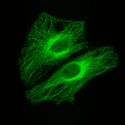
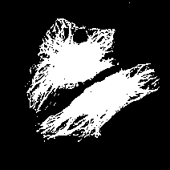
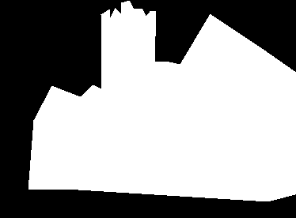
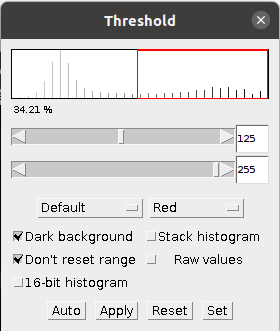
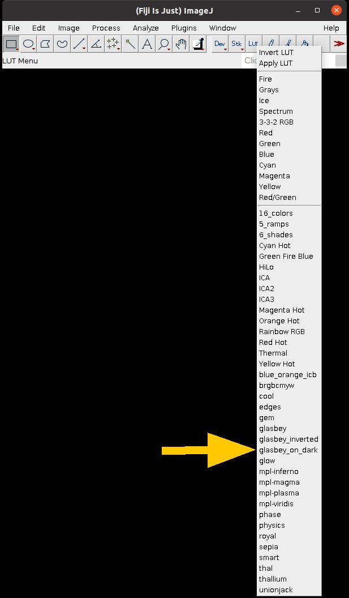
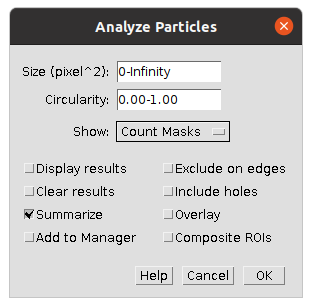

# Segmentation

Segmentation is the separation of an image into areas of interest and areas that are not of interest. The end point for most segmentation is a binary mask. This can be represented as a logical array with true and false values; or a binary array with 0 and 1 values; or an array with only minimum and maximum values e.g. 0 and 255 for an 8-bit image.

| Original Image | Segmentation |
|----------------|--------------|
|  |  |
|  |  |

A binary mask can be used to count, measure or visualise objects.

## :performing_arts: Thresholding: The Art of Separation

Thresholding separates the pixels in an image into two (or more) classes based on intensity. Usually the classes are **foreground** (the objects we care about) and the **background** (the area we don't). This creates a binary mask which can be used for counting, measuring, or visualizing the objects of interest.

### :clipboard: Step-by-Step Instructions

| Step | Action | Details |
|--------|-----------|------------|
| 1      | Open Fiji | Find the executable in the downloaded Fiji folder and double-click to launch it. |
| 2      | Open the Macro Recorder | Navigate to `Plugins > Macro > Record`. |
| 3      | Open an Image | Go to `File > Open Samples > Blobs`. |
| 4      | Experiment with Manual Thresholds | Go to `Image > Adjust > Threshold` and move the sliders. Watch how the red area on the image changes as you move the slider.    |
| 5      | Create a Mask | Click "Apply" |

### :thinking: **Investigate**
- What do the two sliders do?
- What difference does checking the Dark background box make to the mask?​
- Look in the macro recorder output, which lines set the threshold value and apply the mask?​

## :computer: Automatic Thresholding: Let the Computer Do It

A manual threshold can be inconsistent and subjective. To overcome these issues, automatic thresholding methods can be used.

### :clipboard: Step-by-Step Instructions

| Step | Action | Details |
|--------|-----------|------------|
| 1      | Open an Image | Go to `File > Open Samples > Blobs`. |
| 2      | Open the Auto Threshold Tool | Navigate to `Image > Adjust > Auto Threshold`.    |
| 3      | Use the Default Settings | Click "OK" |

A montage showing the results from the different automatic thresholding methods should appear. The name of the method is written under each binary copy of blobs, you may need to zoom in using the magnifying tool to read them. Ask for help if you don't get an image montage or you can't see the method names.

### :thinking: **Investigate**
- Which automatic thresholding method gives the best results for thresholding the blobs image?
- Look up the description of that method on the [Auto Threshold page on the ImageJ website](https://imagej.net/plugins/auto-threshold). Decide if the method you chose is suitable for thresholding the blobs image, e.g. does the method make any assumptions about the histogram?
- Why are the results for the Default and IsoData algorithms similar?

### :clipboard: Step-by-Step Instructions

| Step  | Action | Details |
|-------|-----------|------------|
| 1     | Open an Image | Go to `File > Open Samples > Blobs`. |
| 2     | Open the Auto Threshold Tool | Navigate to `Image > Adjust > Auto Threshold`. |
| 3     | Select a method based on the previous exercise | Click on the Method drop down box and choose a method, then click "OK" |

You should now have a binary mask of the blobs image. If not, please ask for help.

## :link: Connected Component Analysis

Connected component analysis (CCA) is used to identify contiguous objects in a mask. In Fiji for 2D images this can be done using the [Analyze Particles](https://imagej.net/imaging/particle-analysis#analyze-particles) tool.

### :clipboard: Step-by-Step Instructions
 

| Step  | Action | Details |
|-------|-----------|------------|
| 1     | Make your binary mask the active image | Click on the window containing the binary mask |
| 2     | Start the Analyze Particles tool | Navigate to `Analyze > Analyze Particles`. |
| 3     | Select the required settings and run the tool | Match the settings shown in the image      then click "OK" |

You should get results table containing a count (64) and some other measurements as well as an image where each blob is a different shade of grey. If you want to display the results with each blob a different colour, change the Look Up Table (LUT) to glasbey_on_dark (see image on right hand side). 

Particles of any size and shape are counted, which can introduce errors in the final count or when measuring object properties such as size. Objects that should be excluded include:
- Those containing only a few pixels, as they are likely noise.
- Those on the image borders, as they are partial objects and incomplete.

### :thinking: **Investigate**
- Can you change the settings in Analyze Particles to exclude small objects?
- Can you change the settings in Analyze Particles to exclude objects on the image borders?
- Try out some of the different options in the `Show` drop down box to view the different outputs available.
- Try out some of the different checkbox settings, do they change the results? Or produce different outputs?
Please ask for help if you are unsure how to exclude objects from the count given by Analyze Particles.

## Binary operations

Sometimes just thresholding an image does not create a binary mask suitable for connected component analysis. If this is the case, binary operations can be used to improve the suitability of the mask. Some examples are erosion, which shrinks an objects by removing pixels from it's boundary, and dilation, which enlarges an object by adding pixels to it's boundary. The binary operations availabe in Fiji are described in the ImageJ documentation in the [binary section of the process menu](https://imagej.net/ij/docs/menus/process.html#binary).

One tool that is helpful when segmenting round objects like nuclei or nanoparticles is the watershed tool. Watershed segmentation automatically separates round objects that touch. Assuming that blobs is an image of some round objects, try separating them using the watershed tool

| Step  | Action | Details |
|-------|-----------|------------|
| 1     | Make your binary mask the active image | Click on the window containing the binary mask |
| 2     | Apply watershed segmentation | Navigate to `Process > Binary > Watershed`. |
| 3     | Run connected component analysis | Navigate to `Analyze > Analyze Particles` and run the tool with suitable settings (the previous settings should work) |

### :thinking: **Investigate**
- How did the watershed segmentation change the mask?
- How did the watershed segmentation affect the count?
- What is the difference between the binary operations opening and closing?
- What does skeletonize do? Can you think of a situation when you might use it?
Please ask for help if you are uncertain how to apply the watershed segmentation or are unclear what the binary operations do.

## :floppy_disk: Save your current progress

While you have been working the Macro Recorder has been keeping a list of all the commands you have run by clicking in the graphical interface. Some of these will be things you meant to do, some will be things you clicked accidentally and some will be things you tried and rejected. It can be useful to save the Recorder output in case you want to revisit what you have done or remind yourself how you did something .

### :clipboard: Step-by-Step Instructions

| Step  | Action | Details |
|-------|-----------|------------|
| 1     | Make the Macro Recorder the active window | Click on the window containing the Macro Recorder |
| 2     | Create an ImageJ Macro file from the recorded contents | Click `Create`. The Script Editor will open. |
| 3     | Save the macro file | In the Script Editor go to `File > Save As...` and select the location to save and enter a name for the macro. Click `Save`|

This Macro file may not actually run or do anything useful, it is simply to keep a record of what you have tried. For saving the Macro Recorder output, you may find is useful to include the date and a short description of what you were attempting to do or include record in the title, e.g. 20241010_segment_blobs.ijm. This will make the recordings easily identifiable from the macros you write yourself that do run.

## :wrench: Apply Your skills

Try applying the skills you have learnt above to segment and count the nuclei in [nuclei.tif](https://laura190.github.io/warwickcamdu.github.io/material/07-nuclei.tif). Once the file has downloaded you can open it in Fiji either by clicking and dragging the file to the main Fiji window or using `File > Open...`. Make sure you have the Macro Recorder open to keep track of what you are doing. If you want to clear the Recorder before you start, close the window and open it again. The steps you should take are:
- Threshold the nuclei to create a binary mask
- If necessary, apply functions to the binary mask to prepare it for connected component analysis
- Use connected commponent analysis to count the individual nuclei
You will need to test different methods and settings to find a workflow that counts the nuclei accurately.

## :writing_hand: Creating a Macro

If you are happy with the workflow you have created in the previous section, save the output of the Recorder and clear it. Redo the steps of your workflow so that the Recorder contains only the necessary commands. You can delete individual lines from the Recorder by clicking on the line and using backspace or delete. Use the recording to create a Macro.

| Step  | Action | Details |
|-------|-----------|------------|
| 1     | Open the nuclei image | Click and drag the nuclei.tif file in to the main window of Fiji or open it using `File > Open...` |
| 2     | Run the macro on the nuclei image | Click `Run` in the Script Editor Window. |

### :thinking: **Investigate**
- Did the macro stop unexpectedly? Did an error message appear after clicking `Run`? If so, ask for help to fix the errors.
- Is the result from running the macro the same as when you did it manually? If not, why not?
- Think about what each line of code does. Try explaining it to someone or describe it using an annotation. If you are not unsure what each line does, please ask.

## :recycle: Apply the Macro to Another Image