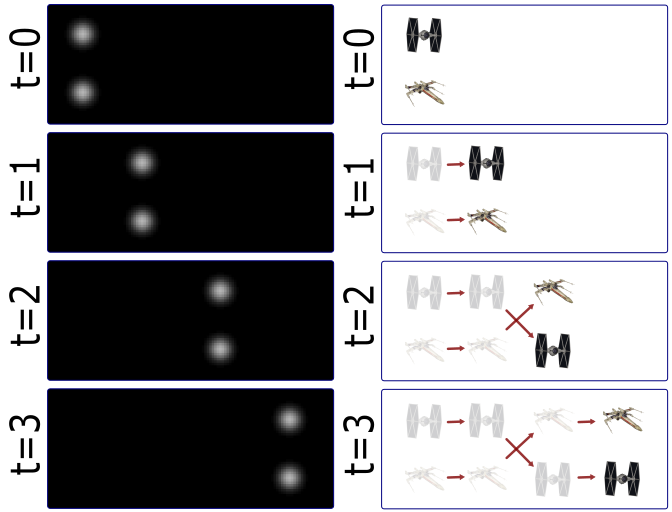
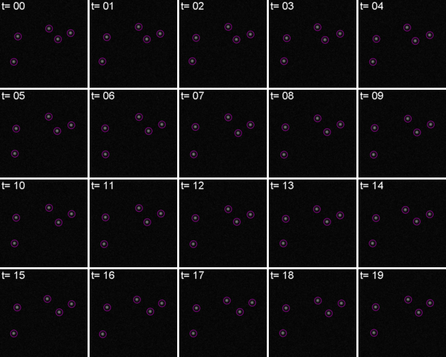
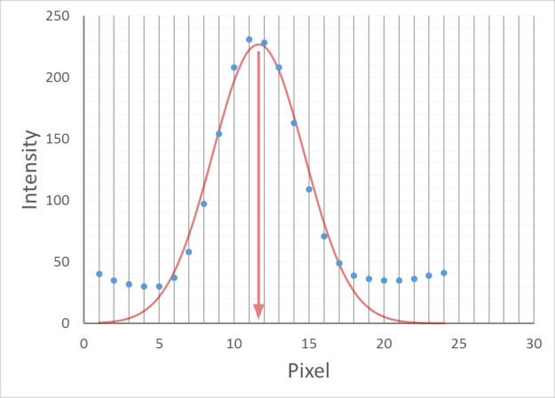
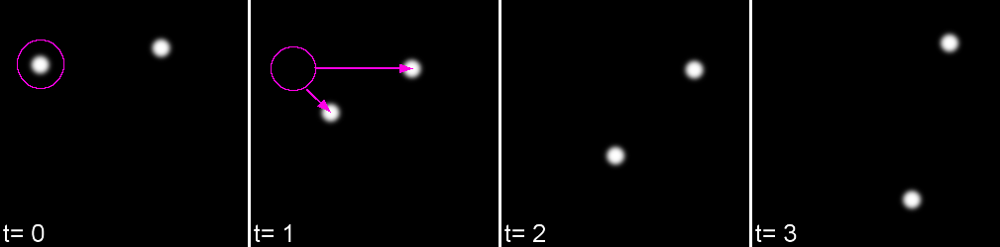
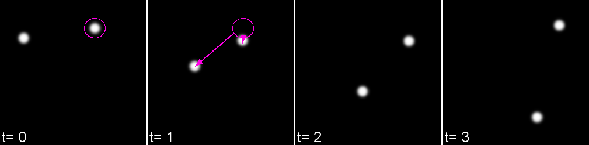
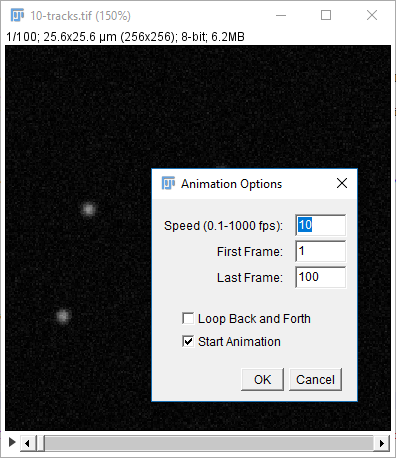
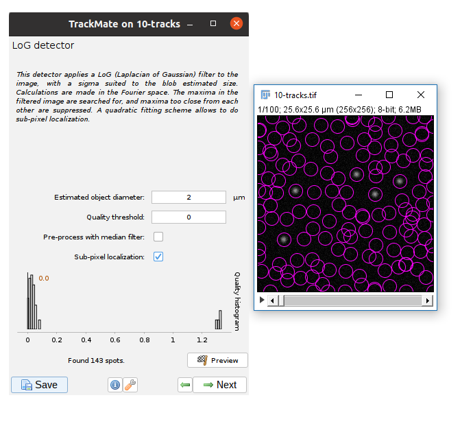

# Preparation

This worksheet is not assessed. Please work through it at your own pace. You may work on your own, with a partner or in a small group.

There are different sections in the worksheet:
- Sections of text to provide context
- **📋 Step-by-Step Instructions**: follow the steps, please ask if the steps are unclear or if you get stuck
- **🤔 Investigate**: suggested things to think about to improve your understanding of image analysis techniques and Fiji tools. These ideas should help you get started, but don't be limited to only these suggestions. Be curious, ask your own questions and experiment with the tools.
- **🔧 Apply Your skills**: A task is given without specific instructions. You should be able to attempt these tasks based on skills you have learnt on this or previous worksheets. Please ask if the task is unclear, something isn't working as you expect or you are unsure how to proceed. Also, you are welcome to design and solve your own task, we're happy to help even if it doesn't relate directly to the worksheets.

Please don't skip the Investigate sections and just rush through the Step-by-Step Instructions! The Investigate sections will help you to develop your own image analysis skills. Please ask if anything is unclear, you are unsure about the purpose of anything you are doing or you can't work out how to do something.

Before starting the worksheet, download the associated [Data folder](https://moodle.warwick.ac.uk/mod/resource/view.php?id=2629717) from Moodle and follow the instructions below.

# Tracking

Uncredited image in this section are from [Dave Mason's image analysis course](https://bitbucket.org/davemason/imageanalysiswithfiji/src/master/).

Life exists in the four dimensions. Tracking allows you to correlate spatial and temporal properties. Most particles look the same! Without any way to identify them, tracking is probabilistic. In the image below, the particles on the left look as if they are moving from left to right. However, if we consider that the two particles are different, e.g. an x fighter and a TIE fighter, it's possible that the upper and lower particles swap position. However, we wouldn't know as they look the same!



Tracking has two parts: Feature Identification and Feature Linking.

## 🔍 Feature Identification



For every frame, features are detected, typically using a Gaussian-based method, e.g. [Laplacian of Gaussian (LoG)](https://en.wikipedia.org/wiki/Blob_detection#The_Laplacian_of_Gaussian).

The position of particles can be determined with subpixel precision. One method determine the subpixel position is by fitting a Gaussian model to the pixel intensity values around the detected spot. Without sub-pixel localisation, the precision of detection is limited to whole pixel values.



## 🔗 Feature Linkage

For each feature, all possible links in the next frame are calculated. This includes the spot disappearing completely. A **cost matrix** is formed to compare the cost of each linkage. A cost matrix is a two-dimensional array that represents the cost of the particle moving from one position to another. This is globally optimised to calculate the lowest cost for all linkages.

 <br>


In it's simplest form, a cost matrix will usually consider distance. Many other parameters can be used such as:
- Intensity
- Shape
- Quality of fit
- Speed
- Motion type

This can allow for a more accurate linkage especially in crowded environments or images with low signal to noise.

### 📋 Step-by-Step Instructions

| Step | Action | Details |
|--------|-----------|------------|
| 1      | Open 10-tracks.tif in Fiji  | Click and drag the 10-tracks.tif file in to the main window of Fiji or open it using `File > Open...` |
| 2      | Play the movie | Click the ▶️ arrow in the lower left hand corner of the image window.  |
| 3      | Change the playback speed | Right click on the ▶️ arrow and change the parameters to set the playback speed |



If you're interested in how the dataset was made see [this snippet](https://bitbucket.org/snippets/davemason/Ke9zz7).

## 🏃‍♂️ TrackMate

[TrackMate](https://imagej.net/plugins/trackmate/) is distributed in Fiji and has a user-friendly interface for performing tracking, data visualization and track analysis. In this example, only a few of the capabilities of TrackMate are used. Please read the documentation to learn more about how TrackMate can be used.



### 📋 Step-by-Step Instructions

| Step | Action | Details |
|--------|-----------|------------|
| 1      | Start TrackMate  | Run ```[Plugins > Tracking > Trackmate]``` |
| 2      | The first dialog allows you to select a subset (in space and time) to process. This is handy on large datasets when you want to calculate parameters before processing the whole dataset. Our dataset it small so use the default settings to process the full stack | Click ```Next``` |
| 3      | Use the default detector (LoG) | Click ```Next``` |
| 4      | Enter appropriate parameters to detect the particles | Set the ```Estimated object diameter``` to 2. Set the ```Quality threshold``` to 0.1. Click ```Preview``` to check the output. |

### 🤔 Investigate
- Do the same settings work for other time points? (change the stack position and click ```Preview``` again)
- What units are used for the object diameter?
- What objects are detected if the quality threshold is 0?
- What happens if you uncheck the ```Sub-pixel localisation``` box?

Aim to use the minimum threshold that prevents the noise from being detected. 

### 📋 Step-by-Step Instructions

| Step | Action | Details |
|--------|-----------|------------|
| 1      | Select the chosen parameters  | Click ```Next``` |
| 2      | Wait for the detection to complete, the proceed | Wait until ```Dectection done in...``` appears near the bottom of the window, then Click ```Next``` |
| 3      | Use the default ```Initial threshold``` | Click ```Next``` |
| 4      | Use the default ```Set filters on spots``` settings | Click ```Next``` |
| 5      | Use the default track (Simple LAP tracker) | Click ```Next``` |
| 6      | Enter appropriate parameters for the tracker | Set the ```Linking max distance``` and ```Gap-closing max distance``` to 5. |

### 🤔 Investigate
- What parameters does the [Simple LAP tracker](https://imagej.net/plugins/trackmate/trackers/lap-trackers) use for the cost matrix?
- What do the ```Linking max distance```, ```Gap-closing max distance``` and ```Gap-closing max frame gap``` parameters do? [This TrackMate tutorial](https://imagej.net/plugins/trackmate/tutorials/getting-started#configuring-the-simple-lap-tracker) might help. Please ask if you are unsure.

### 📋 Step-by-Step Instructions

| Step | Action | Details |
|--------|-----------|------------|
| 1      | Select the chosen parameters  | Click ```Next``` |
| 2      | Wait for the tracking to complete, the proceed | Wait until ```Tracking done in...``` appears near the bottom of the window, then Click ```Next``` |
| 3      | Use the default ```Set filters on tracks``` settings | Click ```Next``` |

### 🤔 Investigate
- Can you change the colour of the spots based on the maximum intensity?
- Can you change the colour of the tracks to show track displacement? Which particle is displaced the most? 
- Can you adjust the settings to only show part of the track? Which do you think is the best way to display the tracks?
- [TrackMate measures]((https://imagej.net/plugins/trackmate/analyzers/)) properties of the spots and tracks. Can you save the spots and tracks results to .csv (comma separated value) files?
- Can you use the TrackScheme to remove a track? Looking at the [TrackScheme documentation](https://imagej.net/plugins/trackmate/views/trackscheme) will help.

### 📋 Step-by-Step Instructions

| Step | Action | Details |
|--------|-----------|------------|
| 1      | Proceed when you are happy with your parameters for displaying the tracks | Click ```Next``` |
| 2      | Plot the mean intensity of the spots against time. | From the ```Features for X axis``` drop down, select T. From the ```Features for Y axis``` drop down, select Mean intensity ch1. Click ```Plot features```. |
| 3      | Process when you are happy with your plots | Click ```Next``` |
| 4      | Create a video of the tracks | Select ```Capture overlay``` option from the drop down menu and then click ```Execute```. Click ```OK``` to keep the default options. Save the resulting image stack. |

## 🎯 Tracking Accuracy

Tracking algorithms will always give a result, so how do you know if it's accurate? The [accuracy of different TrackMate algorithms](https://imagej.net/plugins/trackmate/trackers/accuracy) for tracking different objects in different environments is discussed in the documentation. For the best results make sure the inter-particle distance is greater than the frame-to-frame movement or try to increase resolution (more pixels) or decrease interval (more frames). Look at your output carefully and make sure you're not getting 'jumps' where one particle is linked to another incorrectly. Unless you have problems with noise, blinking, focal shifts and similar, do not introduce gap closing as this may lead to false-linkages. The ```Simple LAP tracker``` does not include merge/spliting events, however TrackMate also has the more complex ```LAP Tracker``` which can handle merging and splitting events. TrackMate also has [other trackers](https://imagej.net/plugins/trackmate/trackers/index) available so you can choose the one most suitable for your system.

Close all open Fiji windows before starting the next section.

## 🔧 Apply your skills

Use TrackMate to track the particles in ```File > Open Samples > Tracks for TrackMate```. Use the ```Simple LAP Tracker``` first and then try the ```LAP Tracker``` to capture the merge and splitting events. You may find the [TrackMate Getting Started Tutorial](https://imagej.net/plugins/trackmate/tutorials/getting-started) helpful.

Close all open Fiji windows before starting the next section.

# Results Management

## 📊 Result and Table windows

You can only have one active results window at a time. This must be named "Results". Other results windows should be renamed. You can use IJ.renameResults to do this. To make a renamed results window active again, rename the previously active window something else and rename the original window "Results" again. Any other open windows displaying results or data are known as Tables.

There are some useful Built-in Functions for managing results in Fiji:

- ```getResult("Column", row)```
- ```setResult("Column", row, value)``` and ```updateResults()```
- ```nResults``` or ```getValue("results.count")```

If you are using a table instead, you can use the [Table functions](https://wsr.imagej.net/developer/macro/functions.html#T):
- ```Table.get("Column", row)```
- ```Table.set("Column", row, value)``` and ```Table.update```
- ```Table.size```

Most of the Table functions will also work for results windows. If you have multiple tables open, you can include the title of the table in the command as the last input argument, e.g. ```Table.get("Column", row, "title")```, to direct the command to the correct table.

### 📋 Step-by-Step Instructions

| Step | Action | Details |
|--------|-----------|------------|
| 1      | Open the spots .csv file from the previous task in Fiji | Click and drag the file into the main Fiji window or use ```File > open``` |
| 2      | Open the subtable.ijm macro  | Click and drag the file in to the main Fiji window or use ```File > open``` |
| 3      | Run the macro | Click ```Run``` in the Script Editor Window |

### 🤔 Investigate
- What does the subtable.ijm macro do?
- Can you adapt the macro to also move the standard deviation of the intensity to the new table.
- Can you write a new macro that extracts the time, mean intensity and standard deviation of the intensity to a new table for track 4 only?
- Can you write a macro that creates a new table containing 4 columns: time, mean intensity plus one standard deviation, mean intensity and mean intensity minus one standard deviation? Can you also save the new table to a separate .csv file? 

## 📈 Graphs

Fiji is not designed to create graphs. It can sometimes be useful to make basic plots in Fiji to check your image analysis pipeline is working as expected or to check initial results. However, to create graphs where you have more control over the appearance and that are suitable for publication, you will need to export your results to another programme (e.g. excel, python, matlab, R, ...). The majority of these programmes will accept a .csv file as an input. You can export the data in the results and table windows as .csv files. In a script you can use ```saveAs(format, path)```.

### 🔧 Apply your skills

Open or import any of the .csv files from the previous task in your favourite plotting software and create a plot of the mean intensity of the spots over time.

## 🔧 Apply your skills
- Use TrackMate to track the particles in ```File > Open Samples > Tracks for TrackMate```. Use the ```Simple LAP Tracker``` first and then try the ```LAP Tracker``` to capture the splits and merges. You may find the [TrackMate tutorial](https://imagej.net/plugins/trackmate/tutorials/getting-started) helpful.
- Unzip nuclei_embryo.zip. This contains a substack of a dataset showing a C.elegans developing embryo from the [Cell Tracking Challenge](https://celltrackingchallenge.net/3d-datasets/). Use TrackMate to track the nuclei. Can you get an accurate result? More information about the dataset can be found in the [related paper](https://www.nature.com/articles/nmeth.1228).