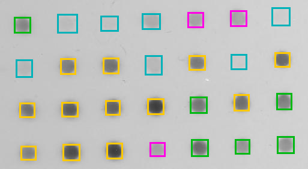
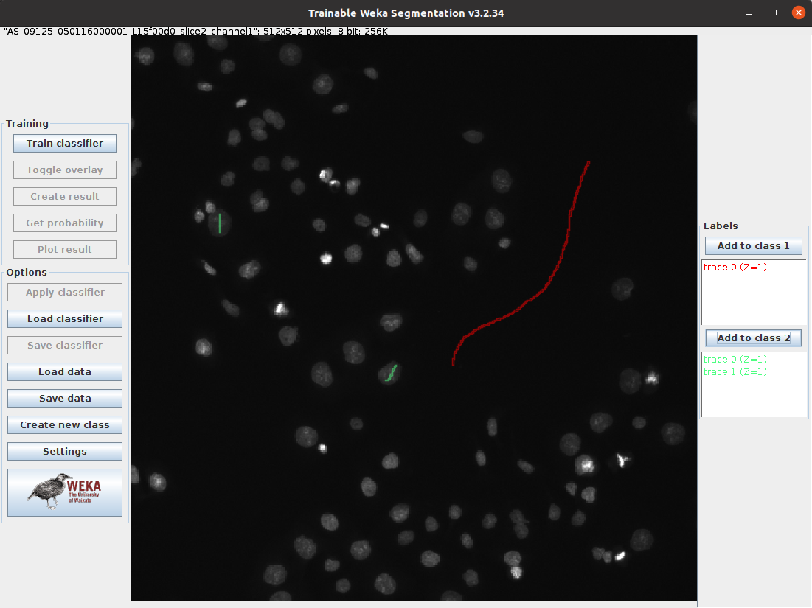
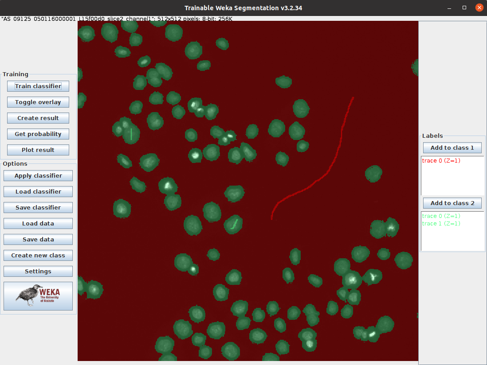

# Validation and Machine Learning

This worksheet is not assessed. Please work through it at your own pace. You may work on your own, with a partner or in a small group.

There are different sections in the worksheet:
- Sections of text to provide context
- **📋 Step-by-Step Instructions**: follow the steps, please ask if the steps are unclear or if you get stuck
- **🤔 Investigate**: suggested things to think about to improve your understanding of image analysis techniques and Fiji tools. These ideas should help you get started, but don't be limited to only these suggestions. Be curious, ask your own questions and experiment with the tools.
- **🔧 Apply Your skills**: A task is given without specific instructions. You should be able to attempt these tasks based on skills you have learnt on this or previous worksheets. Please ask if the task is unclear, something isn't working as you expect or you are unsure how to proceed. Also, you are welcome to design and solve your own task, we're happy to help even if it doesn't relate directly to the worksheets.

Please don't skip the Investigate sections and just rush through the Step-by-Step Instructions! The Investigate sections will help you to develop your own image analysis skills. Please ask if anything is unclear, you are unsure about the purpose of anything you are doing or you can't work out how to do something.

## 📁 Preparation

### **Download the associated Data folder**
**➡️ [Download the Data folder (ZIP)](https://github.com/Laura190/ImageAnalysisWorksheets/raw/main/ValidationAndMachineLearning/Data.zip)**

Download the data before continuing:
1. Click the link above to grab the ZIP archive.
2. Unzip it and launch Fiji as described below.

### 📋 Step-by-Step Instructions

| Step | Action | Details |
|--------|-----------|------------|
| 1      | Open Fiji | Find the executable in the downloaded Fiji folder and double-click to launch it. |
| 2      | Open the Macro Recorder | Navigate to `Plugins > Macro > Record`. |

# Learning Objectives:
- How to quantitatively validate image analysis workflows
- How machine learning can be used in image analysis
- How to use the Trainable Weka Segmentation Plugin

# Validation

After designing an image analysis workflow it is important to validate it, especially if you are planning to use the same process on multiple images. The validation strategies used will depend on the type of problem.

- Measurement
- Classification
- Segmentation

Your final workflow may contain some or all of these problems. In the following sections there are some examples of quantitative measurements that can be used to evaluate the performance for each problem. Regardless of the problem, it is necessary to have some **ground truth** data to compare your results to. The ground truth, or true value, should be evaluated independently from the image analysis pipeline. The method to acquire the ground truth may depend on the area of study. There is often a method that is considered the "gold standard" in the community. There are image data sets that are provided with ground truth data, such as some from the BBBC. These can be used for evaluating how well image analysis pipelines work. However, in most cases you will need to evaluate your own ground truth data to evaluate your image analysis pipeline. Often this involves **manually** counting or measuring something.

# Validation of a Measurement Problem

Aim: Estimate a scalar or vector quantity

Method: Calculate the mean relative error


## 🔢 Comparison of cell count

The number of cells in AS_09125_050118150001_A03f00d0.tif were counted manually by two different human observers. The first person counted 350 cells and the second person counted 362 cells in this image. The mean of the manual counts is 356.

Automatically count the number of cells in AS_09125_050118150001_A03f00d0.tif using the ```Find Maxima...``` tool. Calculate the mean relative error between the count from ```Find Maxima...``` (measured value) and the mean manual count (true value).

The image and manual counts are from [BBBC001](https://bbbc.broadinstitute.org/BBBC001).

# Validation of Classification Problem

Aim: Decide if something is present in an image

Method: Calculate the sensitivity and specificity


The fraction of present things that are correctly detected, 0 none detected to 1 all detected


The fraction of correct detection when the thing is not present, 0 all falsely detected to 1 none falsely detected

## 🗂️ Classification of Dots

The dots in the Dot Blot sample image have been classified by an automated algorithm. The results have been compared to a manual classification by an expert in the field. The dots in orange squares are <span style="color: #ff9900;">True Positives</span>, the dots in the green squares are <span style="color: #00b913;">False Negatives</span>, the dots in magenta squares are <span style="color: #ff00e5;">False Positives</span> and the dots in teal squares are <span style="color: #00b99e;">True Negatives</span>. Calculate the sensitivity and specificity of the automated algorithm.



# Validation of Segmentation Problem

Aim: Estimate the boundary regions of an image

Method: Calculate the difference between the segmented and ground truth boundaries


where N is the number of points, x<sup>s</sup><sub>i</sub> are the points that make up the segmented boundary and x<sup>g</sup><sub>i</sub> are the points that make up the ground truth boundary. This is to calculate the root mean square error, but other metrics can also be used, e.g. Hausdorff distance

## 🧩 Segment graphene grains

Segment the large graphene grain (dark region) in graphite_image.tif. Use the rmse2Dselections.ijm macro to calculate the root mean square error between your segmentation and the ground truth segmentation in graphite_mask.tif. Take a look at the macro first to figure out how it works and what inputs you need to provide. If you are not sure, please ask.

The graphite data is from [nanoMFG](https://github.com/nanoMFG/unet-sem/tree/master).

For more information on validation see Chapter 10 of Handbook of Medical Imaging, Volume 2. Medical Image Processing and Analysis (K. Bowyer, 2000).

# Machine Learning

Machine learning is a branch of artificial intelligence that trains algorithms based on data. If you a dataset and have obtained the ground truth data using the "gold standard" method, you may be able train a machine learning algorithm. You will need **enough** data and associated ground truth data, however it is difficult to know how much data is enough. It is dependent on the complexity of the task to be accomplished, the quality of the data available and the required accuracy of the results. You may need tens of thousands of samples for some tasks, but hundreds of samples may be enough for simpler tasks. Evaluating the ground truth data is often a manual, user intensive process, so there is a balance to be found when deciding how much testing data to use.of samples. Assuming that you have enough training data and that is representative of the whole dataset, a portion of the data will be used to train the algorithm and a portion will be used for testing.

Machine learning algorithms are designed to find patterns in data. **Training** (supervised learning) takes a set of input data and it's known outputs and trains a model to predict the output for new data. Machine learning can be used to train classfication models, which separate input data into categories. It can also be used for denoising, isotropic reconstruction and surface projections (See [CSBDeep](https://csbdeep.bioimagecomputing.com/) for examples). Training a model can be very time consuming, it can require a lot of user input and computing time. Using a Graphical Processing Unit (GPU) rather than the Central Processing Unit (CPU) can speed up the processing time.

## 🦾 Machine Learning for Pixel Classification

The [Trainable Weka Segmentation Fiji Plugin](https://imagej.net/plugins/tws/) combines a collection of machine learning algorithms with selected image features to produce segmentations. Other software options include:

- [LabKit](https://imagej.net/plugins/labkit/), another Fiji Plugin
- [ilastik](https://www.ilastik.org/index.html), python based software that can also do object classification and more
- [Paintera](https://github.com/saalfeldlab/paintera), primarily focused on 3D neuron reconstruction from electron micrographs

Unzip the BBBC008_partial.zip folder. This is a subset of BBBC008 from the Broad Bioimage Benchmark Collection (the same dataset was used in the [Measuring, Stitching and Batch Processing Worksheet](MeasuringStitchingAndBatchProcessing/MeasuringStitichingAndBatchProcessing.md)).

### 📋 Step-by-Step Instructions



| Step | Action | Details |
|--------|-----------|------------|
| 1      | Open the Trainable Weka Segmentation Plugin in Fiji  | In Fiji, navigate to ```Plugins > Segmentation > Trainable Weka Segmentation``` |
| 2      | Open on the images from the subset of the BBBC008 data | Select one of the images for the BBB008_partial folder |
| 3      | Draw a line in the background of the image | Click and drag on the dark region of the image |
| 4      | Add the selection to class 1 | Click ```Add to class 1``` on the right |
| 5      | Draw a line on one or two of the nuclei | Click and drag on one or two of the light regions in the image |
| 6      | Add the selection to class 2 | Click ```Add to class 2``` on the right |
| 7      | Train the model | Click ```Train classifier``` on the left |



### 🤔 Investigate
- Can you improve the results by adding more labels and retraining the classifier?
- In the setting menu of the Weka plugin, you can select or deselect different ```Training features```. How does removing or adding a training feature change the results when you retrain the model? If you can't find these settings please ask. For more information about each feature, visit the Plugin webpage
- When you are happy with the result, click Apply classifier and select a different image from the data set. Does the classifier work well for this image too?

You can also train on multiple images:

### 📋 Step-by-Step Instructions

| Step | Action | Details |
|--------|-----------|------------|
| 1      | Save the model | Click Save data and save the data.arff file |
| 2      | Close all open Fiji windows | Close the Trainable Weka Segmentation Window and any other open image windows |
| 3      | Start the Weka Plugin | ```Plugins > Segmentation > Trainable Weka Segmentation``` and select another image to open. |
| 4      | Load the previous model | Click and open the data.arff file |
| 5      | Apply the classifier from the previous model | Click ```Train classifier``` |
| 6      | Add the selection to class 2 | Click ```Add to class 2``` on the right |
| 7      | Train the model | Add more labels and click Train classifier again. |

### 🤔 Investigate
- Does training on another image improve the results?
- Can you apply the classifier to all the images in the BBBC008_partial folder?
 
## 💾 Save your progress

If you haven't already, remember to save your the output from the Macro Recorder so you have a record of what you have done.
