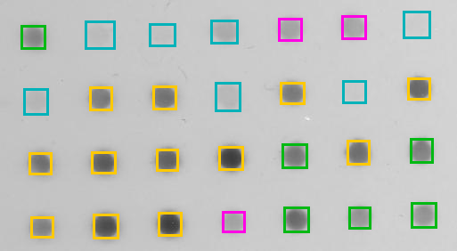

# Validation

After designing an image analysis workflow it is important to validate it, especially if you are planning to use the same process on multiple images. The validation strategies used will depend on the type of problem.

- Measurement
- Classification
- Segmentation

Your final workflow may contain some or all of these problems. In the following sections there are some examples of quantitative measurements that can be used to evaluate the performance for each problem. Regardless of the problem, it is necessary to have some **ground truth** data to compare your results to. The ground truth, or true value, should be evaluated independently from the image analysis pipeline. The method to acquire the ground truth may depend on the area of study. There is often a method that is considered the "gold standard" in the community. There are image data sets that are provided with ground truth data, such as some from the BBBC. These can be used for evaluating how well image analysis pipelines work. However, in most cases you will need to evaluate your own ground truth data to evaluate your image analysis pipeline. Often this involves **manually** counting or measuring something.

# Validation of a Measurement Problem

Aim: Estimate a scalar or vector quantity

Method: Calculate the mean relative error

$$ mean\ relative\ error = \frac{measured\ value - true\ value}{true\ value}$$

## Comparison of cell count

The number of cells in AS_09125_050118150001_A03f00d0.tif were counted manually by two different human observers. The first person counted 350 cells and the second person counted 362 cells in this image. The mean of the manual counts is 531.

Automatically count the number of cells in AS_09125_050118150001_A03f00d0.tif using the ```Find Maxima...``` tool. Calculate the mean relative error between the count from ```Find Maxima...``` (measured value) and the mean manual count (true value).

The image and manual counts are from BBBC01.

# Validation of Classification Problem

Aim: Decide if something is present in an image

Method: Calculate the sensitivity and specificity

$$ Sensitivity = \frac{True\ Positives}{True\ Positives + False\ Negatives}$$

The fraction of present things that are correctly detected, 0 none detected to 1 all detected

$$ Specificity = \frac{True\ Negatives}{True\ Negatives + False\ Positives}$$

The fraction of correct detection when the thing is not present, 0 all falsely detected to 1 none falsely detected

## Example - Classification of Dots

The dots in the Dot Blot sample image have been classified by an automated algorithm. The results have been compared to a manual classification by an expert in the field. The dots in orange squares are <span style="color: #ff9900;">True Positives</span>, the dots in the green squares are <span style="color: #00b913;">False Negatives</span>, the dots in magenta squares are <span style="color: #ff00e5;">False Positives</span> and the dots in teal squares are <span style="color: #00b99e;">True Negatives</span>. Calculate the sensitivity and specificity of the automated algorithm.



# Validation of Segmentation Problem

Aim: Estimate the boundary regions of an image

Method: Calculate the difference between the segmented and ground truth boundaries

$$ root\ mean\ square\ error = \sqrt{\frac{\sum^N_{i=1}\left(\mathbf{x^s_i}-\mathbf{x^g_i}\right)^2}{{N}}} $$

where $N$ is the number of points, $x^s_i$ are the points that make up the segmented boundary and $x^g_i$ are the points that make up the ground truth boundary. This is to calculate the root mean square error, but other metrics can also be used, e.g. Hausdorff distance

## Example: Segment graphene grains

Segment the large graphene grain (dark region) in graphite_image.tif. Use the rmse2Dselections.ijm macro to calculate the root mean square error between your segmentation and the ground truth segmentation in graphite_mask.tif. Take a look at the macro first to figure out how it works and what inputs you need to provide. If you are not sure, please ask.

The graphite data is from (nanoMFG)[https://github.com/nanoMFG/unet-sem/tree/master].

# Training and Testing

- Let's assume you have some ground truth data for your images that has been obtained using the "gold standard" method
- You also have the original dataset, on which no analysis has been performed
- When developing an algorithm, a portion of the data will be used for training the algorithm and a portion will be used for testing
- While more testing data will produce in more accurate results. However, evaluating the ground truth is often a manual, user intensive process, so there is a balance to be found when deciding how much testing data to use. 
- The testing data should be representative of the whole dataset.

This is how machine learning algorithms are trained. For more information on validation see Chapter 10 of Handbook of Medical Imaging, Volume 2. Medical Image Processing and Analysis (K. Bowyer, 2000)

# Built-in Functions

There are some useful Built-in Functions for managing results in Fiji:

- getStatistics()
- getResult("Column", row)
- setResult("Column", row, value) and updateResults()
- nResults or getValue("results.count")

# Results windows

You can only have one active results window at a time. This must be named "Results".
Other results windows should be renamed. You can use IJ.renameResults to do this.
To make a renamed results window active again, rename the previously active window something else and rename the original window "Results" again.

# Graphs

Fiji is not designed to create graphs
You will need to export your results to another programme (e.g. excel, python, matlab, ...)
saveAs(format, path)
Export the results as a .csv (comma separated value) file
